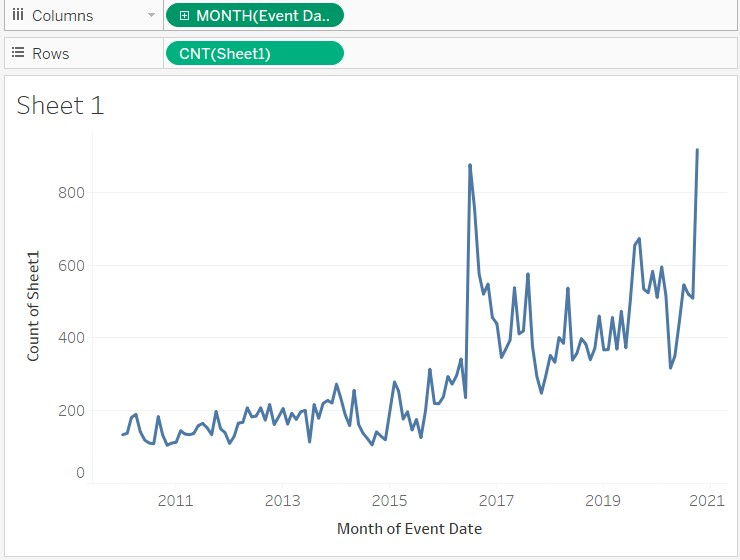
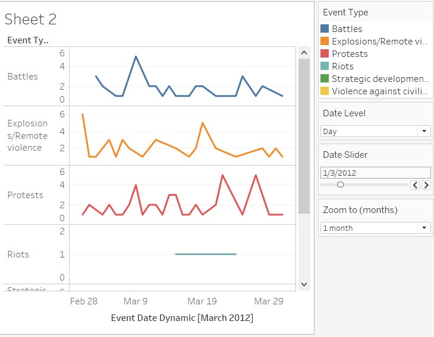
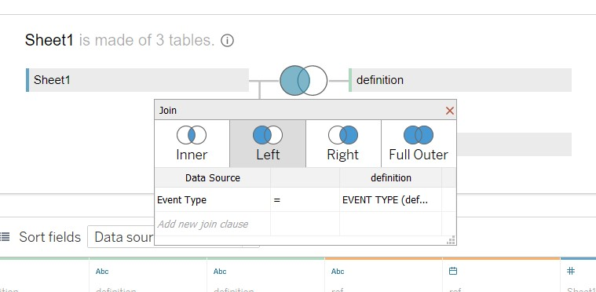
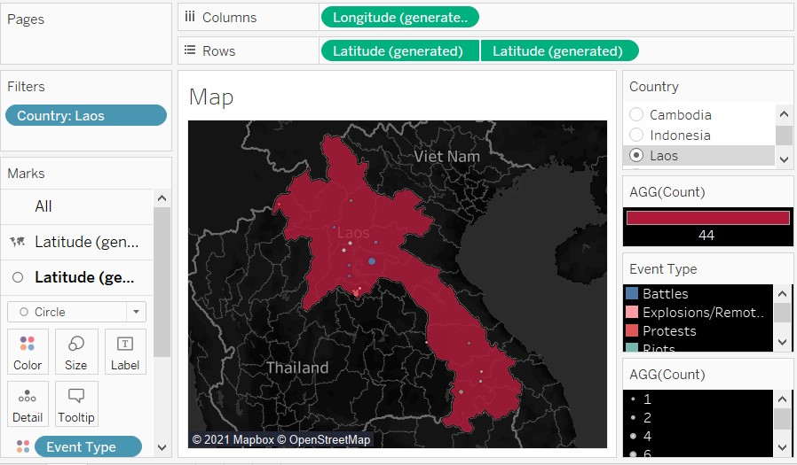
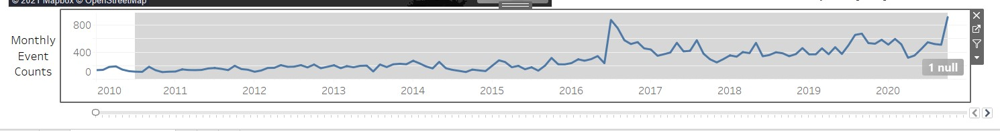
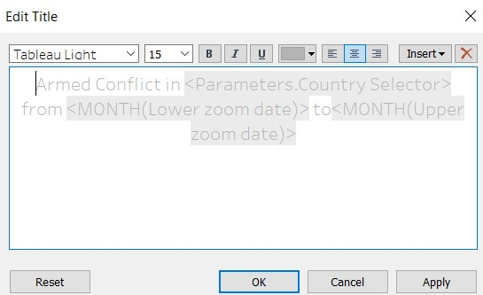
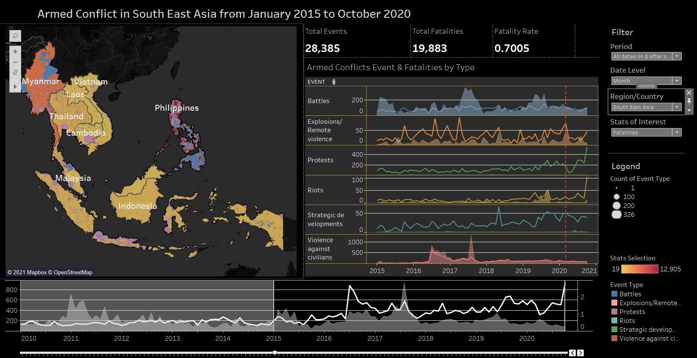

---
output: html_document
---

<style>
img {
    max-width: none;

    /* other options:
    max-width: 1200px;
    */
}
</style>

```{r setup, include=FALSE}
knitr::opts_chunk$set(echo = FALSE, options(width = 100))
```
**Data Visualisation Link (Tableau Public)** - https://public.tableau.com/profile/tan.huiyong#!/vizhome/ArmedConflictSEA/ArmConflictSEA?publish=yes

# Contents {#top}
a. [Critiques and Suggestions for Current Visualisations](#a)
b. [Proposed alternative data visualisation](#b)
c. [Proposed alternative data visualisation](#c)
d. [Step-by-step description of visualization](#d)
e. [5 Observations from Final Visualization](#e)

# a.    Critiques and Suggestions for Current Visualisations{#a} 
[*Back to top*](#top)


### Clarity
1. During the data exploration, it was observed that multiple events / event types could have occurred at the same location over time. The visualization of interest uses geospatial dot plot to depict the incidents, but it does not utilize size or tooltip to indicate the number of events or fatalities. The visualization could have been amended such that the number of incidents could be observed based on the size of the dot and/or tooltip.

2. The scale of the line charts do not start at zero. This can be misleading when the visualization is used to show the number of incidents. As shown in the image below, it can be visually misleading that the number of “Battles” is quite low at certain point of time as it is almost at the bottom of the scale. However, this is not the case as the number of “battles” are around 400 at the bottom of the scale. The scale can be changed such that the bottom of the scale starts from zero.


\


### Aesthetics
3. Axis labels, “counts of sheet1”, are not properly named. This label is not only redundant but also make the visualization aesthetically unpleasant due to the fact the choice of words is inappropriate. The axis label can be removed as it is relatively easy for the user to infer that the y-axis of the line charts refers to the number of incidents that has taken place.

4. A single color was applied onto the lines for all event types in the line charts, while the geospatial dot plot utilized colors to differentiate each of the event type. This is a form of inconsistency in the visualization. The line charts could adopt the same color scheme as the geospatial dot plot.

5. It was observed that some of the countries like Vietnam does have “Battles” occurring in some the years. These null values result in broken line charts as shown below. Cosmetic procedures should have been applied to ensure that the line charts are not broken. One of the ways to correct this is to replace the null values with 0.


\

6. Countries like Laos have low number of incidents of interest and this makes it difficult for user to see the boundary of the countries. The visualization could be improved if the boundary of the countries is clearly shown.


\

### Interactivity
7. The visualization does not provide an easy method to toggle the date level (showing in years, quarter, etc). This impairs user who need to analyze the dates of the incidents. Interactive parameters or buttons could be added to allow easy toggle of the dates.

8. Fixed date filter was pre-applied onto the visualization, which limits the period the user could toggle with.

9. The visualization has limited interactivity with only toggling of country filter and highlighting plot points of the same event types. More interactivity could be added.

# b.     Proposed alternative data visualisation{#b} 
[*Back to top*](#top)


### Alternative design
The proposed makeover would consist of 3 charts (1 choropleth map overlay geospatial dot plot, 1 stacked line charts with vertical separation and 1 line chart with dynamic date slider and filter), 1 panel of text display showing key summary statistics and 1 sidebar showing the legends and filters.


### Advantages
**Choropleth Map**


1.	The choropleth map would show clear international boundaries of each country within South East Asia and the default map would show the whole region of South East Asia.

2.	Heat map is applied onto the chart to allow the user to have a gauge of the relative number of incidents occurring amongst the country. 

3.	The incidents provided by the data source are about armed conflicts, which are considered as negative events. Hence, the visualization would be using dark map team to give an atmosphere of “dark” events occurring in South East Asia. 

4.	The geospatial dot plot would be retained with event types differentiated by colors. The key improvement from the initial visualization is that the size of the dot plots is determined by the number of events within any given time frame. 

5.	Tooltip of the dot plot will show the total fatalities for the incidents taken place at that location.

6.  Tooltip of the choropleth map will show a cross tab of total fatalities and events of each event type in each country.
\

**Stacked Line Charts with vertical separation**

1.	The colors of each line would be consistent to those in the geospatial dot plot. This will show consistencies.

2.	The tooltip over the line charts would show the brief description of each event types, the counts of incidents and fatalities at that point of time.

3.	Calculated fields would be used to ensure null values are replaced with 0 to avoid any breakage of the line charts.

4.	Interactivity is improved with the level of date granularity customizable with either a radio button or drop-down list.

5.	The scale of the line charts is dynamic, with the bottom scale set at zero.

6.	The axes labels are removed as it is redundant.
\

**Line Chart with Dynamic Date Slider and Filter**

1.	This is a new chart not found in the original visualization. The main purpose of it is to increase the interactivity such that users can scroll on a line chart showing the number of incidents over time.

2.	Users are also able to toggle the period of interest (date filter).
\

**Text Display with Key Summary Statistics**

This portion would show the user key figures like total fatalities and the total incidents per event type in any given time-frame. This would provide a clear and concise information with one glance.
\

**Legends & Filters**

The legends and filters are placed to increase the interactivity.


# c.     Proposed alternative data visualisation{#c}
[*Back to top*](#top)

  [Link to Tableau Public](https://public.tableau.com/profile/tan.huiyong#!/vizhome/ArmedConflictSEA/ArmConflictSEA)
  
  \
  \
  
# d.    Step-by-step description of visualization{#d}
[*Back to top*](#top)

## Data Cleaning and exploration

Prior to visualization, the data in Ms Excel format was studied extensively and was referenced against the data code book provided by [ACLED](https://acleddata.com/acleddatanew/wp-content/uploads/dlm_uploads/2019/01/ACLED_Codebook_2019FINAL.docx.pdf). The data dictionary extracted from the codebook is listed below for easy reference.


The data was imported into tableau and it was observed that Tableau had inserted the wrong metadata type for some the fields. Therefore, the metadata of the fields are changed based on the nature of the data. 

{width=80%}

Next, fields that are of no interest in the visualization will be hidden for neater working environment.

{width=50%}
\

### Line Chart with Dynamic Date Slider and Filter
Open a new worksheet. The line chart would first be plotted.[Event Date] and [sheet1(count)] are placed onto the “Columns” and “Rows” respectively to generate the line chart.

The [Event Date] is converted into “Continuous” and toggled to monthly level. This would result in a line chart that depicts values at monthly level.



The horizontal axis of the chart is fixed based on the min/max date so that the axis would not be truncated by any date filter.

{width=80%}

To turn it into a slider, a parameter and some calculated fields had to be included. 

The parameter, [Date Slider], would determine the period of interest and it would be a date data type taking date values from [Event Date].


Next, another parameter [Zoom to (months)] would be made. This would allow user to select a predetermined length of period (months, years level) for neater analysis. The settings are shown below.

{width=80%}
2 calculated fields are made and they would determine the lower and upper bound off the period of interest.


It is important to convert the 2 calculated fields to continuous.

{width=70%}

Drag [Lower zoom date] and [Upper zoom date] into “details” of “Marks” and toggle to month level.

{width=50%}

With the required fields ready, the “window” of the period of interest could be displayed on the line graph by inserting 2 vertical reference lines. 

{width=50%}

The first reference line would be the lower bound and it would take the form of a band to allow shading of the area in the line chart to differentiate the area of interest from the one that is not. The setting can be found in the screenshot below.

{width=70%}

The second reference line would be the upper bound. Similarly, it would take the form of a band, with a slightly different setting to toggle the shading accordingly. The setting can be found in the screenshot below.

{width=70%}
The result of the slider worksheet is a line chart with dynamic band which has adjustable width and the band can be shifted by selection of of date of interest.


The aesthetics of the chart would be touched up later when we build the dashboard as the color scheme and style must be consistent.
\

### Stacked Line Charts with vertical separation
A new worksheet is opened and a simple stacked line charts with vertical separation is constructed. This was done by placing [Event Date] into columns while [Event Type] and [sheet1(count)] are placed into rows. The [Event Type] is also placed into “Color” of the “Marks” to provide each event type a unique color. 


The vertical axis label is removed, and the range is set to be independent range for each row, and it would include zero values.

{width=70%}

The changes would result in a cleaner look of the chart.


To make the visualization more dynamic and interactive, the tick marks horizontal axis must become more dynamic. This can be achieved by using parameter and calculated fields.

The parameter would provide a list of date level for user to toggle, ranging from day to year level.

{width=70%}

The following calculated field, [Event Date Dynamic] is inserted to utilize the parameter to toggle the date granularity. [Event Date Dynamic] is then set as continuous date at exact date level.


{width=50%}

[Event Date (ref)] was added to the filter and it is filtered by conditions to show the date of interest as toggled by user.

{width=70%}

It was observed that some configuration would result in broken line charts due to null values and missing data. 

{width=100%}

{width=50%}

As such, an additional reference table, “Ref_Table_Date_Event_Type”, consisting of date ranging from the minimum and maximum of [Event Date] and all [Event Type] is made.

A right join to the reference table is made on both [Event Date] and [Event Type]. This would ensure that each event date for each event type would occur.

{width=100%}

An additional calculated field is required to count the occurrence of events accurately.

The calculated field has the following settings and it would replace [sheet1(count)] in the “Rows”.

{width=90%}

The calculated fields from earlier had to be edited to replace [Event Date] with [Event Date (ref)].

{width=90%}

The date filter had to change to [Event Date (ref)] as well to ensure consistency

{width=70%}

The amendment would result in complete line charts for all configurations


A reference table that indicates the definition of each event type is created with reference to the ACLED codebook. This reference table would be brought into the tooltip such that the data tooltip would include the definition of the event type.


This table would be joined to the main data source based on the following conditions.

{width=90%}

Both [Event Description] and [General] were placed into the tooltip of the line chart and the tooltip settings is configured.

{width=80%}

{width=70%}
\

### Choropleth Map

A new sheet is created.The [Longitude (generated) and [Latitude (generated)] are placed into “Columns” and Rows” respectively. [Country] was placed into the “Details” of the “Marks” and “Map” was selected as the type of chart displayed. A choropleth map of South East Asia will appear as shown.

{width=100%}

Due to the joining of the original data with the date/event type reference table, 1 unknown (null value) would appear. This indicator will be kept for now.
It is of interest to create a dot plot on the map, hence, another instance of [Latitude (generated)] was placed onto “Rows”. However, this time, circle” mark was selected instead. This would result in another map being generated showing dots on the countries of interest. 

{width=100%}

[Latitude] and [Longitude] were placed into “Details” of the “Marks”. They are both converted to “Dimension” to generate the dot plot based on the exact locations of events that took place.

{width=100%}

The purpose of the choropleth map is not only to show the clear boundaries of countries, but also show the relative number of events using heat map. Hence, [Count] was placed onto the “color” of the mark. On the other hand, the dot plot would be showing the different types of events that took place, so [Event type] was placed into the “Color” while the size is toggled to be smaller so that it is more appealing to the eyes.

{width=100%}

The two charts are combined by selecting “Dual Axis” in the rows option.

{width=100%}

{width=100%}

[Count] is placed into the size of the dot plot so that locations that had more events would look bigger.

{width=100%}

The theme of the map was changed to “Dark” and the colors of both choropleth and the dot plots are changed accordingly. “Null” was also hidden in the legends. [Fatalities] was then placed into the tooltip.

{width=100%}

[Country] was added to the “Filters” card. The filter was tested by selecting Laos in the [Country] filter list. The filter will result in the map zooming onto Laos. Unfortunately, the color of the country had changed from pale orange to deep red as the color blend changed dynamically according to the filter.

{width=100%}

As such, the color blend had to be fixed at the start and end such that the filter of country would not result in changing in color.

{width=70%}

{width=100%}

Same [Event Date (ref)] filter will be applied to this worksheet so that the visualization would change accordingly based on the selection in the Slider.

{width=70%}

Further interactivity will be created at dashboard level.

[Lower zoom date] and [Upper zoom date] are both added to the “Details” in the “Marks” such that the title of the chart could reflect according to the period of interest.

{width=40%}

[Country] is added to label to allow clearer indication of the countries shown on the map.

{width=100%}

A worksheet <Tool Tip>, consisting of cross tab information on the number of events and fatalities for each event type is created. This worksheet would be used as the tooltip for the choropleth map so that user would be able to see more details of events and fatalities when they hover the countries of interest.

{width=90%}

Thereafter, the “Tooltip” of the map worksheet is configured as below.

{width=80%}

One example can be seen below.

{width=70%}

### Textbox

3 additional worksheets [Text Box], [Text Box 2] and [Text Box 3] will be built to show the summary figures of total events, total fatalities, and fatality rate. A calculated field had to be created to show fatality rate.

{width=100%}

{width=100%}

{width=100%}

{width=100%}

## Dashboard
A new dashboard, “Arm Conflict SEA”, is created. The size is set as “Automatic”.

{width=50%}

 Map, Date Slider and the stacked line chart worksheets are dragged into the canvas in the following arrangement.

{width=100%}

The title and readout of Slider is removed, and the slider filter is place below the Slider worksheet. The tile and axes labels Slider are removed and a text box “Monthly Event Counts” is placed on the left of the slider to display the axis in horizontal orientation. 

{width=100%}

Next the color theme of the dashboard is then set according to the theme used in the Map worksheet. The side panel would be arranged.

{width=100%}

Unknown indicators due to joining of reference table would be hidden.

{width=40%}

It is noted that the filter panel for country will have null value. This must be removed by using parameter as filter.

{width=30%}

A new parameter is created with setting shown below.

{width=80%}

The country filter would then be based on the following condition which would filter the country selected in the parameter. If “All” is selected, it will trigger TRUE for all conditions, hence displaying all countries. 

{width=70%}

A dynamic vertical reference line is added to line chart such that use could select any date on the line chart and the reference line will move to it. This is first done by constructing a date parameter with the following setting.

{width=70%}

Next a reference line is created on the line chart.

{width=70%}

To make the reference line dynamic, a “Change Parameter” action is created. This action would point to the dashboard and allow the Ref Line Dynamic parameter to change based on the date selection on the line chart.

{width=70%}

The resulting reference line would be dynamic and could shift as user click on different parts of the line chart.

{width=100%}

Now, the dashboard is equipped with more interactivity

{width=100%}

It is noted that the title of the visualization is taken from Map worksheet. To make the title on the top center of the dashboard, the title must be made as a separate worksheet to retain its dynamic words that change according to user’s selection during the interaction. The purpose of this worksheet is to obtain the title and its content is not important. Hence, a dummy field had to be created to show blank values in the worksheet.

{width=100%}

The setting of the worksheet is as shown.

{width=80%}

{width=70%}

This Title worksheet is then placed at the top center of the dashboard and the original title of Map is hidden away.

Next, the stacked line chart is given another change.a Dual axis with synchronized axis is created with [sum(fatalities)]. The fatalities is show in area chart with light color tone than that of the event


{width=90%}

With all of the changes made, the final dashboard is completed.

{width=100%}


# e. 5 Observations from Final Visualization{#e}
[*Back to top*](#top)

### Deadliest Year

{width=100%}

The deadliest year occurred in 2017 with 5,496 fatalities recorded. This is mainly due to 2 separate events occurring in Myanmar and Philippines. In Aug 2017, the Myanmar government began crackdown on Rohingya population in retaliation to the attacks carried out by Rohingya insurgents ([National Geographic](https://www.nationalgeographic.com/culture/article/rohingya-refugee-crisis-myanmar-burma-spd)). Meanwhile, Philippines experienced one of the deadliest crisis when parts of the Marawi city was occupied by extremist militants and the governmental troops retook it after a 5 month long seige     ([Aljazeera]( https://www.aljazeera.com/features/2017/10/29/what-happened-in-marawi)).

### Lowest Fatality from 2015- 2020 - Vietnam

{width=100%}

Vietnam recorded the lowest number of fatality and fatality rate among the countries listed in the visualization. From the perspective of the ACLED, Vietnam might be one of the safest country among the countries listed in the visualization.